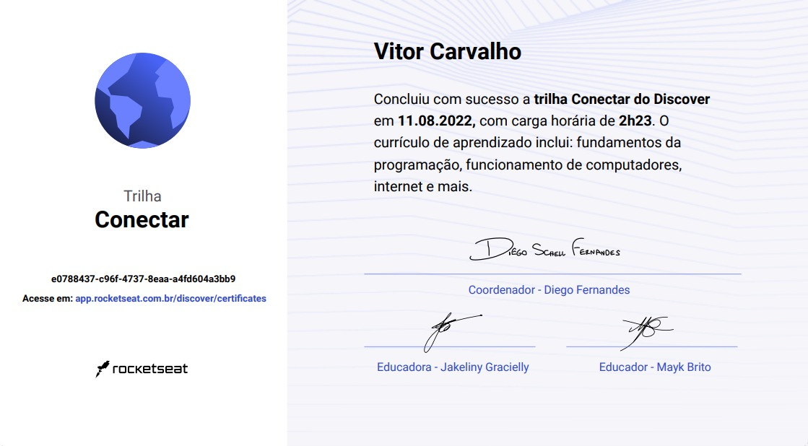

# Programa Discover - Rocketseat 🚀

`Repositório em construção.`

## O que é?

O programa [Discover](https://rocketseat.com.br/discover) da [Rocketseat](https://rocketseat.com.br) é um programa prático e gratuito para você entrar no universo de tecnologia, entender todas as possibilidades da profissão e iniciar sua jornada no mundo dev. A metodologia do Discover é trabalhada e aperfeiçoada a partir de um conjunto de 12 métodos de aprendizagem ativa que garante o máximo de eficiência nos seus estudos. Foco, muita prática e conexão com devs são os pilares que sustentam a metodologia.

## Status

`📚 Cursando`

## Tecnologias estudadas

    
    
    
    
    
    
    
    

## Certificados

  
    
Código: e0788437-c96f-4737-8eaa-a4fd604a3bb9 

## Módulos

**Feitos:** `✔️`
 
**Em andamento ou pendentes:** `❌`

### 🌎 Conectar (Carga horária: 2 horas)

1. ✔️ Guia Estelar de Programação
1. ✔️ Computador, Software e Hardware ✨
1. ✔️ Internet, Roteadores e Servidores ✨
1. ✔️ Sistemas Operacionais ✨
1. ✔️ Linguagem de Programação ✨
1. ✔️ Tipos de Aplicações WEB ✨

### 🪐 Fundamentar (Carga horária: 29 horas)

1. ✔️ Ambiente Dev
1. ✔️ Guia Estelar de HTML
1. ✔️ Guia Estelar de CSS
1. ✔️ Nem tudo são Pixels
1. ✔️ Uma caixa dentro da outra
1. ✔️ Agora sim, cores
1. ✔️ Posso ver e ouvir o HTML
1. ✔️ Posicionando foguetes
1. ✔️ App bonito, até nos textos
1. ✔️ Formulários de outro planeta
1. ✔️ Guia Estelar JavaScript
1. ❌ HTML que faz sentido, para todos
1. ❌ Nem só de classes ou IDs
1. ❌ Alinhando os planetas
1. ❌ Pilotando com a DOM
1. ❌ Terminal
1. ❌ NodeJS
1. ❌ Node + EJS
1. ❌ SQL
1. ❌ Estruturas de Dados  ✨
1. ❌ Programação Orientada a Objetos ✨
1. ❌ Programação Funcional ✨
1. ❌ Guia Estelar de Git
1. ❌ Guia estelar de Github
1. ❌ Guia Estelar de HTTP

### Especializar (Carga horária: 7 horas)

1. ❌ Javascript Assíncrono e Promises
1. ❌ Trabalhando com APIs
1. ❌ Fundamentos de ReactJS
1. ❌ Fundamentos de Typescript
