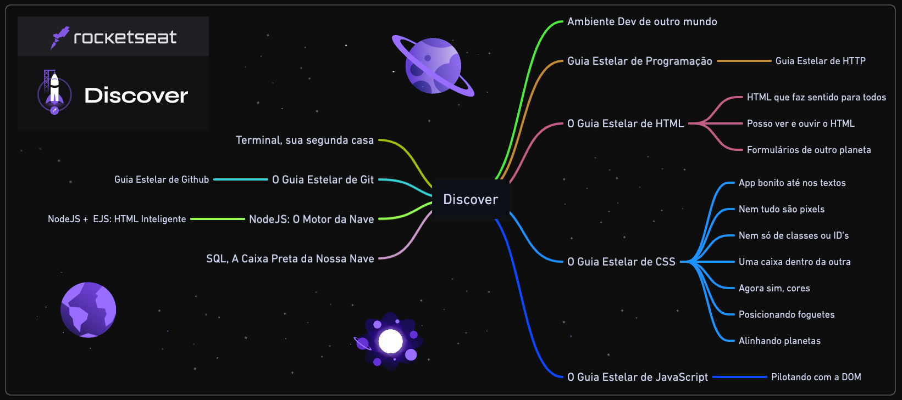

# Programa Discover - Rocketseat 🚀

`Repositório em construção.`

## O que é?

O programa [Discover](https://rocketseat.com.br/discover) da [Rocketseat](https://rocketseat.com.br) é um programa prático e gratuito para você entrar no universo de tecnologia, entender todas as possibilidades da profissão e iniciar sua jornada no mundo dev. A metodologia do Discover é trabalhada e aperfeiçoada a partir de um conjunto de 12 métodos de aprendizagem ativa que garante o máximo de eficiência nos seus estudos. Foco, muita prática e conexão com devs são os pilares que sustentam a metodologia.

## Status

`📚 Cursando`

## Tecnologias estudadas

    
    
    
    
    
    
    
    

## Certificados

  
    
Código: e0788437-c96f-4737-8eaa-a4fd604a3bb9 

## Módulos

**Feitos:** `✔️`
 
**Em andamento ou pendentes:** `❌`

### **Equipando sua nave**

1. ✔️ Ambiente dev de outro mundo
1. ❌ Terminal, sua segunda casa

#

### **Guias estelares**

1. ✔️ Guia Estelar de Programação
2. ✔️ O Guia Estelar de HTML
3. ✔️ O Guia Estelar de CSS
4. ✔️ O Guia Estelar de JavaScript
5. ❌ Guia Estelar de HTTP

### **Preparação de astronautas**

1. ✔️ (HTML) Formulários de outro planeta
2. ✔️ (HTML) Posso ver e ouvir o HTML
3. ✔️ (CSS) App bonito, até nos textos
4. ✔️ (CSS) Nem tudo são pixels
5. ✔️ (CSS) Uma caixa dentro da outra
6. ✔️ (CSS) Agora sim, cores
7. ✔️ (CSS) Posicionando foguetes
8. ❌ (CSS) Alinhando os planetas
9. ❌ (CSS) Nem só de classes ou ID's
10. ❌ (JS) Pilotando com a DOM
11. ❌ (HTML) HTML que faz sentido, para todos

### **Viajando ao espaço**

1. ❌ NodeJS: O Motor da Nave
1. ❌ NodeJS + EJS: HTML Inteligente
1. ❌ SQL, a caixa preta da nossa nave
